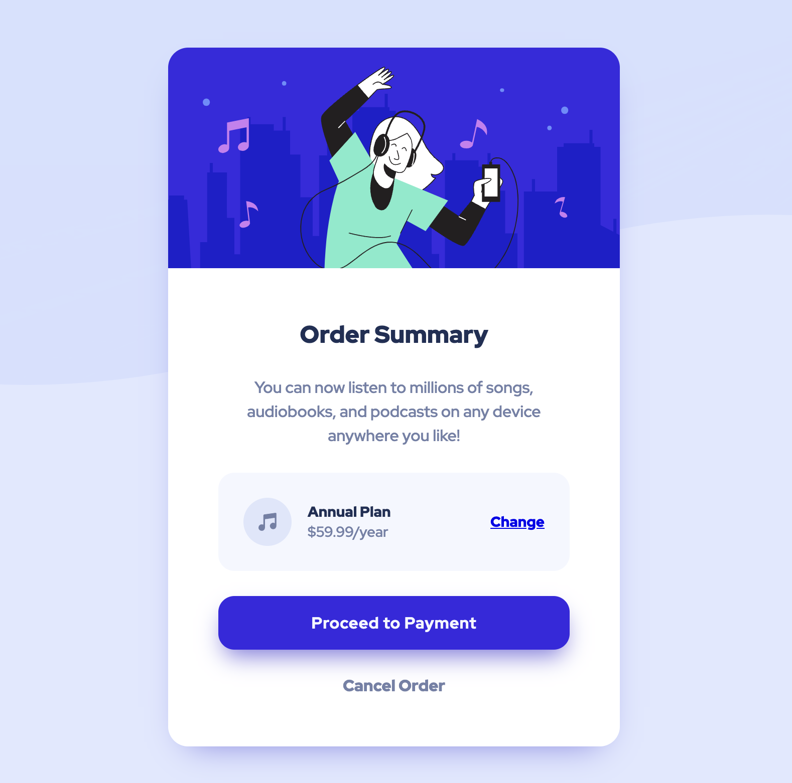

# Frontend Mentor - Order summary card solution

This is a solution to the [Order summary card challenge on Frontend Mentor](https://www.frontendmentor.io/challenges/order-summary-component-QlPmajDUj). Frontend Mentor challenges help you improve your coding skills by building realistic projects.

## Table of contents

- [Overview](#overview)
  - [The challenge](#the-challenge)
  - [Screenshot](#screenshot)
  - [Links](#links)
  - [Built with](#built-with)
  - [What I learned](#what-i-learned)
  - [Continued development](#continued-development)
- [Author](#author)

## Overview

This was my first Frontend Mentor Project after a short break, so I started easy. I also have learned Svelte and Sass in the meantime, so I wanted to try to create and deploy this using SvelteKit. Overall, it was a success and I estimated the time it would take me to finish fairly well.

### The challenge

Users should be able to:

- See hover states for interactive elements

### Screenshot

### Links

- Solution URL: [Frontend Mentor](https://www.frontendmentor.io/solutions/order-summary-component-yk64SLhm9f)
- Live Site URL: [Netlify](https://willetto-order-summary.netlify.app/)

### Built with

- Sass
- [Svelte](https://svelte.dev/) - JS library
- CSS Grid
- CSS custom properties
- Mobile-first workflow

### What I learned

I wasn't familiar with SvelteKit's routing in regards to global styles, but I was able to find [some resources](https://joyofcode.xyz/global-styles-in-sveltekit) and implement a general layout and some CSS global variables.

### Continued development

I was only able to use Sass locally scoped in a Svelte component. I want to figure out how to configure Vite and Svelte kit to have Sass and the Sass variables & mixins woven into the architecture.

## Author

- Website - [Trey Willetto](https://www.treywilletto.com)
- Frontend Mentor - [@willetto](https://www.frontendmentor.io/profile/willetto)
